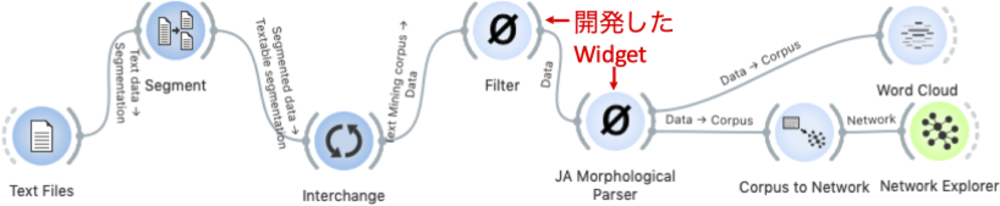

JA Morphological Parser
===========

Morphological Analyzer for Japanese

Signals
-------

- Inputs: Table class or Corpus class
- Output: Table class or Corpus class

Description
-----------
- Morphological Analyzer for Japanese to meta(string) data in Table class / Corpus class.